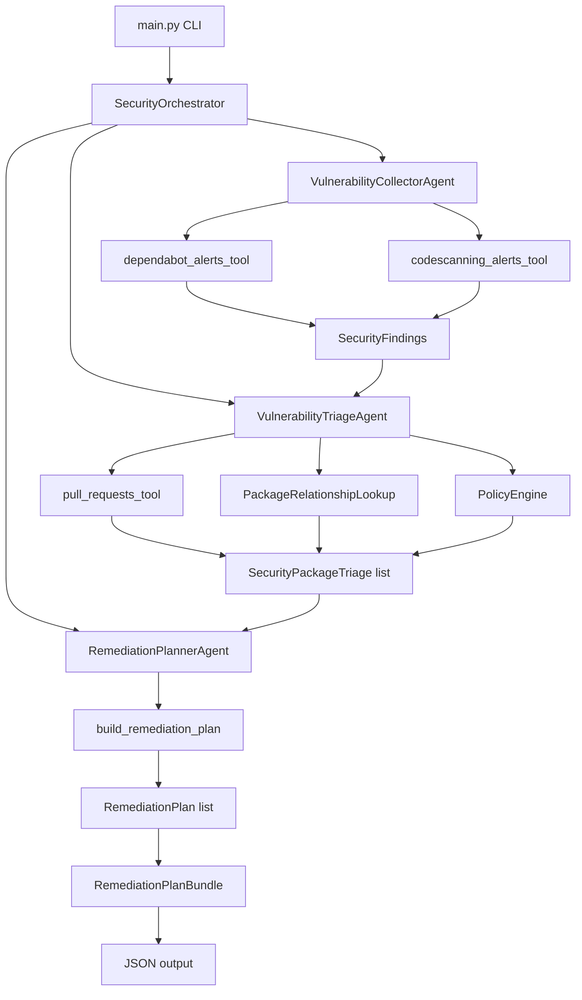
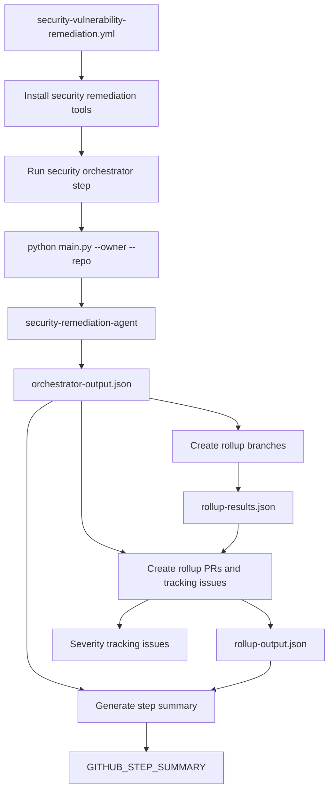

# Security Remediation Agent Design

## Scope

This document focuses on the Python package in `security-remediation-agent`. The agent analyzes a repository's security findings and returns a structured remediation plan bundle as JSON. The final section shows how `.github/workflows/security-vulnerability-remediation.yml` invokes the agent and consumes that JSON for tracking issues and workflow summaries.

## Goal

Convert raw GitHub security signals into package-level remediation decisions:

- what package is vulnerable;
- whether the dependency is direct or transitive;
- what version fixes the issue;
- whether the fix is breaking or non-breaking;
- whether an existing pull request already resolves it;
- what action should be taken next.

## Design Diagram



## Workflow Integration

`security-vulnerability-remediation.yml` is the runtime wrapper around the Python agent. The workflow installs the package, invokes `main.py`, stores the agent response in `orchestrator-output.json`, and then uses that output to create/update tracking issues and generate the run summary.



### Agent Invocation

The workflow step named `Run security orchestrator` calls the Python entrypoint with the caller repository identity:

```bash
python ./octo-gha-tools/security-remediation-agent/main.py \
  --owner "${GITHUB_REPOSITORY_OWNER}" \
  --repo  "${GITHUB_REPOSITORY#*/}" \
  > orchestrator-output.json
```

The workflow then checks the number of generated plans in `orchestrator-output.json` and sets `has_work=true` when remediation work exists.

## Component Responsibilities

| Component | Responsibility |
|---|---|
| `main.py` | Parses `--owner` and `--repo`, runs the orchestrator, and serializes the result to JSON. |
| `SecurityOrchestrator` | Coordinates collect, triage, and plan stages. |
| `VulnerabilityCollectorAgent` | Calls GitHub security collection tools and returns `SecurityFindings`. |
| `dependabot_alerts_tool` | Reads Dependabot vulnerability alerts. |
| `codescanning_alerts_tool` | Reads code scanning alerts. |
| `VulnerabilityTriageAgent` | Groups alerts by package, enriches dependency relationships, matches pull requests, and applies policy. |
| `pull_requests_tool` | Reads open pull requests and extracts dependency version bumps. |
| `PackageRelationshipLookup` | Enriches packages with direct/transitive dependency context. |
| `PolicyEngine` | Computes severity, fixed version, breaking impact, and fixability. |
| `RemediationPlannerAgent` | Converts triage items into remediation plans. |
| `build_remediation_plan` | Builds direct or transitive `RemediationPlan` objects. |
| `RemediationPlanBundle` | Groups plans by severity and exposes the final bundle. |

## Data Flow

1. `main.py` receives repository identity as `owner` and `repo`.
2. `SecurityOrchestrator.run()` starts the pipeline.
3. `VulnerabilityCollectorAgent.collect()` fetches Dependabot and code scanning findings.
4. `VulnerabilityTriageAgent.triage()` groups Dependabot alerts by package.
5. Triage enriches each package with dependency relationship details.
6. Triage reads open pull requests and maps version bumps to affected packages.
7. `PolicyEngine` selects highest severity, minimum recommended fixed version, and breaking/non-breaking classification.
8. `RemediationPlannerAgent.plan()` builds one remediation plan per triaged package.
9. `RemediationPlanBundle.from_plans()` groups plans by severity.
10. `main.py` prints the JSON-safe bundle.

## Core Models

| Model | Purpose |
|---|---|
| `SecurityFindings` | Container for collected Dependabot and code scanning alerts. |
| `SecurityPackageTriage` | Package-level view of alerts, dependency relationship, PR matches, and policy results. |
| `PullRequestMetadata` | Open PR metadata plus dependency version bumps. |
| `RemediationPlan` | A single package remediation decision. |
| `PackageContext` | Package, ecosystem, severity, relationship, version range, and advisory IDs. |
| `FixPlan` | Fix class, target versions, and availability flags. |
| `ActionPlan` | Next action: use an existing PR, create a placeholder, or open an issue. |
| `RemediationPlanBundle` | Severity-grouped collection of remediation plans. |

## Remediation Decisions

Each `RemediationPlan` separates the remediation decision into two fields:

- `fix.fix_class` describes the kind of fix the package needs.
- `action.action_type` describes what should happen next with that fix.

### Fix Class

| Fix class | Meaning |
|---|---|
| `NO_FIX_AVAILABLE` | No known safe upgrade path is available from the collected advisory and dependency data. |
| `NON_BREAKING_BUMP` | A fixed version exists and the upgrade is expected to stay within the current major version or otherwise be non-breaking. |
| `BREAKING_BUMP` | A fixed version exists, but the upgrade crosses a breaking boundary such as a major version change. |
| `PARTIAL_FIX_AVAILABLE` | Both non-breaking and breaking fix paths are known. The agent prefers the non-breaking path when an adequate PR exists. |

### Action Type

| Action type | Meaning |
|---|---|
| `rollup_pr` | Existing PR can be included in a grouped remediation change. |
| `standalone_pr` | Existing PR should be handled independently. |
| `placeholder_pr` | A fix is known, but no adequate PR exists yet. |
| `open_issue` | No actionable fix is known or more investigation is required. |

### Fix-to-Action Rules

| Fix class | Existing adequate PR? | Action type |
|---|---|---|
| `NO_FIX_AVAILABLE` | Not applicable | `open_issue` |
| `NON_BREAKING_BUMP` | Non-breaking PR exists | `rollup_pr` |
| `NON_BREAKING_BUMP` | No adequate PR exists | `placeholder_pr` |
| `BREAKING_BUMP` | Breaking PR exists | `standalone_pr` |
| `BREAKING_BUMP` | No adequate PR exists | `placeholder_pr` |
| `PARTIAL_FIX_AVAILABLE` | Non-breaking PR exists | `rollup_pr` |
| `PARTIAL_FIX_AVAILABLE` | Only breaking PR exists | `standalone_pr` |
| `PARTIAL_FIX_AVAILABLE` | No adequate PR exists | `placeholder_pr` |

## Direct Dependency Logic

For direct dependencies, the agent remediates the vulnerable package itself. It checks whether a fixed version exists, classifies the bump as breaking or non-breaking, and links an existing pull request when the PR bumps the same package to an adequate version.

## Transitive Dependency Logic

For transitive dependencies, the vulnerable package is not directly declared by the repository. The agent identifies the direct source package that brings it into the dependency graph, then plans the fix against that source package. Existing PRs are accepted only when their version bump reaches the required fixed version.

## Output Contract

The CLI writes a JSON object representing `RemediationPlanBundle`. The bundle is grouped by severity and each plan includes:

- package context;
- fix details;
- action decision;
- existing issue state when available;
- audit entries explaining how the plan was created.

Downstream automation can consume this JSON to create branches, pull requests, issues, dashboards, or reports.

## Workflow Consumers

The remediation workflow consumes the agent output in three main places:

| Workflow step | Input | Output | Purpose |
|---|---|---|---|
| `Run security orchestrator` | Repository owner and name | `orchestrator-output.json` | Executes the Python agent and captures the remediation plan bundle. |
| `Create rollup branches` | `orchestrator-output.json` | `rollup-results.json` | Groups plans by severity, impact, and action type, then records branch/stub results. |
| `Create rollup PRs and tracking issues` | `orchestrator-output.json`, `rollup-results.json` | `rollup-output.json`, GitHub issues | Creates or updates severity-level tracking issues and records created PR/issue metadata. |
| `Generate step summary` | `orchestrator-output.json`, `rollup-output.json` | `$GITHUB_STEP_SUMMARY` | Publishes a concise run summary with counts, remediation PR links, tracking issue links, and severity breakdowns. |

### Tracking Issue Creation

The `Create rollup PRs and tracking issues` step uses `actions/github-script` to build one tracking issue per severity group. Each issue body summarizes:

- total security alerts;
- direct and transitive dependencies affected;
- non-breaking and breaking update counts;
- remediation PR links by impact and action;
- per-package vulnerability details;
- recommended merge order.

If a matching tracking issue already exists, the workflow updates its body and labels. Otherwise, it creates a new issue and records the issue number, URL, and title in `rollup-output.json`.

### Output Summary

The `Generate step summary` step writes a human-readable summary to `$GITHUB_STEP_SUMMARY`. It reports:

- base branch;
- open security alerts;
- open code scanning alerts;
- open PRs reviewed;
- PRs matched as remediation;
- findings without existing PRs;
- remediation PRs auto-created;
- tracking issues created or updated;
- severity split for non-breaking and breaking fixes.

## Current Pipeline

```text
collect -> triage -> plan -> JSON bundle
```

Review and reporting hooks exist in the orchestrator shape but are not active in the current implementation.
